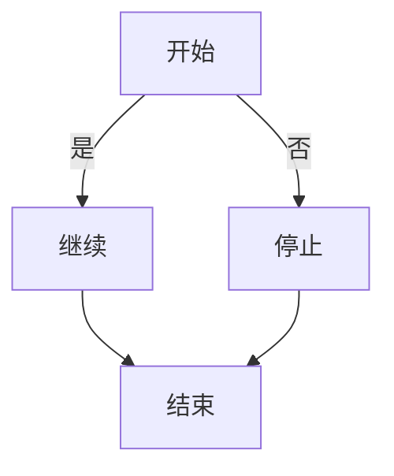

# 快速开始指南

## 5 分钟上手

### 1. 准备环境

确保你已安装 Rust：

```bash
curl --proto '=https' --tlsv1.2 -sSf https://sh.rustup.rs | sh
source $HOME/.cargo/env
```

验证安装：

```bash
rustc --version
cargo --version
```

### 2. 克隆项目

```bash
git clone https://github.com/yourusername/mermaid-cli.git
cd mermaid-cli
```

### 3. 编译项目

```bash
# 开发版本（编译快，运行慢）
cargo build

# 发布版本（编译慢，运行快）
cargo build --release

# 编译完成后，可执行文件位于：
# - 开发：./target/debug/mermaid-cli
# - 发布：./target/release/mermaid-cli
```

### 4. 运行你的第一个图表

创建 `example.mmd` 文件：



保存为 `example.mmd`，然后运行：

```bash
./target/release/mermaid-cli example.mmd -o example.svg
```

打开生成的 `example.svg` 文件，你应该能看到一个流程图！

---

## 常见任务

### 任务 1: 渲染单个文件

```bash
mermaid-cli input.mmd -o output.svg
```

### 任务 2: 从终端直接生成

```bash
cat << 'EOF' | mermaid-cli --stdin -o diagram.svg
graph TD
    A[Step 1] --> B[Step 2]
    B --> C[Done]
EOF
```

### 任务 3: 检查和修复错误

错误的图表代码：

```
grpah TD
A[Start]-->B
```

检查错误：

```bash
echo 'grpah TD; A[Start]-->B' | mermaid-cli check --show-fixes
```

自动修复：

```bash
echo 'grpah TD; A[Start]-->B' | mermaid-cli fix
```

### 任务 4: 批处理多个文件

```bash
#!/bin/bash
for file in diagrams/*.mmd; do
    output="docs/$(basename "$file" .mmd).svg"
    mermaid-cli "$file" -o "$output"
    echo "✓ Generated: $output"
done
```

### 任务 5: 与 CI/CD 集成（GitHub Actions）

在 `.github/workflows/render-diagrams.yml`：

```yaml
name: Render Mermaid Diagrams

on:
  push:
    paths:
      - 'diagrams/*.mmd'
  pull_request:

jobs:
  render:
    runs-on: ubuntu-latest
    steps:
      - uses: actions/checkout@v3
      
      - name: Download mermaid-cli
        run: |
          curl -L https://github.com/yourusername/mermaid-cli/releases/download/v0.1.0/mermaid-cli-x86_64-unknown-linux-gnu \
            -o mermaid-cli
          chmod +x mermaid-cli
      
      - name: Render diagrams
        run: |
          for file in diagrams/*.mmd; do
            ./mermaid-cli "$file" -o "docs/$(basename "$file" .mmd).svg"
          done
      
      - name: Commit changes
        run: |
          git config user.name "CI"
          git config user.email "ci@example.com"
          git add docs/*.svg
          git commit -m "Render diagrams" || true
          git push
```

---

## 项目结构速览

```
mermaid-cli/
├── docs/                 ← 你在这里
├── src/
│   ├── main.rs          ← CLI 入口
│   ├── lib.rs           ← 公共 API
│   ├── parser/          ← 解析模块
│   ├── renderer/        ← 渲染模块
│   ├── fixer/           ← 纠错模块
│   └── svg/             ← SVG 生成
├── tests/               ← 集成测试
├── examples/            ← 示例文件
└── Cargo.toml           ← 项目配置
```

---

## 开发命令速查

```bash
# 编译
cargo build              # 开发版本
cargo build --release   # 发布版本

# 测试
cargo test              # 运行所有测试
cargo test lexer        # 运行特定测试
cargo test -- --nocapture  # 显示输出

# 代码检查
cargo clippy            # 代码优化建议
cargo fmt               # 格式化代码
cargo doc --open        # 生成并打开文档

# 性能
cargo bench             # 运行基准测试
RUST_LOG=debug cargo run  # 带调试信息运行

# 清理
cargo clean             # 删除编译产物
```

---

## 常见问题

### Q: 编译失败，说缺少依赖

**A:** 确保安装了最新的 Rust：

```bash
rustup update
cargo clean
cargo build
```

### Q: 如何在 macOS 上运行？

**A:** 一样的命令。如果编译失败，可能需要指定目标：

```bash
cargo build --release --target x86_64-apple-darwin
```

### Q: Windows 上能用吗？

**A:** 可以，但需要 MSVC 或 GNU 工具链。建议使用：

```bash
rustup target add x86_64-pc-windows-gnu
cargo build --release --target x86_64-pc-windows-gnu
```

### Q: SVG 输出看起来很简单？

**A:** 正确！MVP 版本使用简单的布局。后续版本会改进。你可以在生成后用 SVG 编辑器（如 Inkscape）手动调整。

### Q: 能用作库吗？

**A:** 可以！在 `Cargo.toml` 中添加：

```toml
[dependencies]
mermaid-cli = { path = "../mermaid-cli" }
```

然后在代码中使用：

```rust
use mermaid_cli::{render, parse};

fn main() {
    let svg = render("graph TD; A-->B").unwrap();
    println!("{}", svg);
}
```

---

## 下一步

- 📖 读 [DEVELOPMENT.md](./DEVELOPMENT.md) 了解开发工作流
- 🏗️ 读 [ARCHITECTURE.md](./ARCHITECTURE.md) 理解项目结构
- 🛣️ 读 [ROADMAP.md](./ROADMAP.md) 了解计划
- 📚 读 [API.md](./API.md) 学习完整 API

---

## 需要帮助？

- 📋 GitHub Issues — 报告 Bug 或提功能请求
- 💬 Discussions — 讨论想法和设计
- 📧 联系维护者

---

**祝你开发愉快！** 🚀
